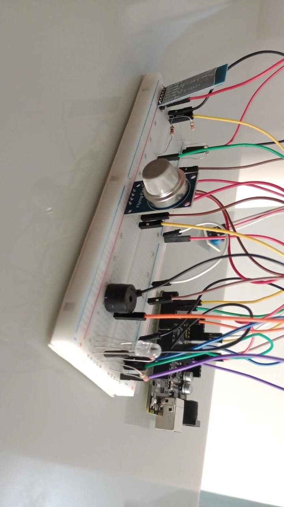
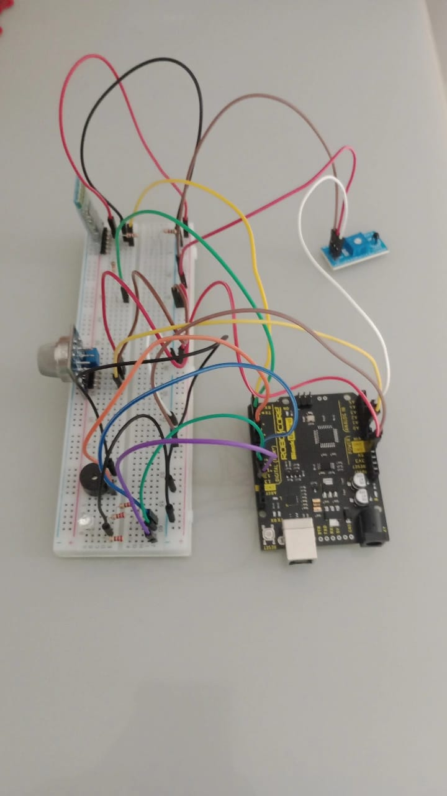

# Sistema de Monitoramento e Alerta de Incêndio residencial

Este repositório contém um projeto desenvolvido para aprendizado, prática e demonstração de habilidades em programação, eletrônica e microcontroladores. Servindo como um portfólio de experimento.

Data de Iníco: 1 de outubro de 2024

Versão Atual: FireAlarmSystem-29-10-2024

## Visão Geral

 **Objetivo** 
  - Desenvolvimento de um sistema de alerta de incêndios baseado em Arduino que monitore a temperatura e presença de gases inflamáveis e fumaça. O sistema é capaz de informar, por meio de sinais visuais e sonoros, o início de um incêndio ou possível foco.  

  **descrição**
  - O projeto usa sensores conectados a uma placa Arduino para medir constantemente os valores de temperatura e presença/concentração de gás e fumaça no ambiente. Caso as medições do ambiente ultrapassem as condições de temperatura e presença de fumaça consideradas normais, um alerta visual e sonoro é emitido, notificando rapidamente os moradores da residência na qual o sistema está instalado. Resultando em uma resposta mais eficiente dos envolvidos.

## Componentes do sistema

### Hardware
| Componente                     | Função                                          |
|--------------------------------|-------------------------------------------------|
| Arduino BlackBoard UNO R3      | Controlador principal para processamento e controle dos dispositivos |
| Sensor de Temperatura Termistor NTC | Para medição da temperatura ambiente         |
| Sensor de gás MQ-135           | Detectar gases inflamáveis e fumaça               |
| Buzzer ativo                   | Emite alertas sonoros                             |
| LED RGB                        | Alertas visuais                                   |
| Módulo Bluetooth HC-05         | Notificação e comunicação remota via Bluetooth    |

### Software

IDE Arduino - Ambiente de Desenvolvimento para codificação e upload de código para o Arduino.

Bibliotecas Arduino:

- [Thermistor.h](https://github.com/panStamp/thermistor?tab=readme-ov-file)
- [SoftwareSerial.h](https://docs.arduino.cc/learn/built-in-libraries/software-serial/)

### Lista de Materiais

- 3 resistência de 220Ω
- 3 resistências de 1kΩ
- 1 Protoboard
- jumpers

### Conexões e Pinos

LED RGB:
- pin Red -> Arduino pino digital 11
- pin Grenn -> Arduino pino digital 10
- pin Blue -> Arduino pino digital 9
  
Buzzer ativo -> Arduino pino digital 6

Sensor MQ-135 -> Arduino pino analógico A0

Termistor NTC -> Arduino pino analógico A1

### Alimentação

Placa Arduino: 5V (cabo USB tip B) ou 7-12V (Jack de energia)

Thermistor NTC: 3.3V a 5V

Sensor de Gás MQ-135: 5V

Buzzer Ativo: 3V a 5V

LED RGB
- Red: 2V
- Green: 3.2V
- Blue: 3.2V

Módulo Bluetooth HC-05
- VCC: 5V
- Pinos RX e TX: 3.3V

## Controle do Sistema

Ao iniciar o sistema é importante conectá-lo ao bluetooth. Isso habilita o envio de informações pela comunicação bluetooth, permitindo acesso ao controle de execucção do minotramento dos dados obtidos.
Inicialmente, o sistema começa em estado STOP, ou seja, desligado, sem monitorar os dados.
- **Ligar o Sistema:** digite **1** no prompt de comando da comunicação ou aplicação.
- **Desligar o Sistema:** digite **0** no prompt de comando da comunicação ou aplicação.

## Imagem do Circuito

### Requisistos do Sistema

Requisitos Funcionais:
- Emissão de alerta sonoro e visual quando os valores de temperatura ou fumaça ultrapassam os limites seguros
- Monitoramento contínuo de temperatura e presença de fumaça

Requisitos Não Funcionais:
- Baixo consumo de energia para operação prolongada
- Alta precisão na leitura dos sensores

## Testes e Calibração

Em função da garantia de qualidade e precisão, o sistema precisa ser calibrado:

- Teste Sensor de Temperatura: Expor o sensor a diferentes temperaturas verificando os valores lidos, confirmando se coincide com a temperatura do ambiente. *Taxa de erro: 1°C a 2°C.*
- Sensor de Gás: É recomendado deixar o sensor de gás ligado por 24 horas, passando pelo processo de tempo de queima **(burn-in-time)**. Período necessário para que o sensor estabilize sua resistência interna e apresente leituras mais precisa.
- Teste de Alerta: Simular situações críticas para validar as repostas dos alertas sonoros e luminosos

## Manutenção e Atualizações

**Manutenção Regular:**
- Verificar a recalibrar os sensores periodicamente
- Garantir que os componentes estejam protegidos contra poeira e umidade

**Possíveis Atualizações**
- Integração com sistemas de casas inteligentes
- Integração com aplicativos móveis para notificações instantâneas.

## Links Complementares

- [Arduino BlackBoard UNO R3](https://www.robocore.net/placa-robocore/arduino-blackboard)
- [Termistor NTC](https://www.mundodaeletrica.com.br/sensor-ntc-caracteristicas-funcionamento/)
- [MQ-135](https://www.makerhero.com/blog/como-funciona-o-sensor-de-gas-mq-135/)
- [Buzzer ativo](https://sensorkit.arduino.cc/sensorkit/module/lessons/lesson/04-the-buzzer)
- [LED RGB](https://components101.com/diodes/rgb-led-pinout-configuration-circuit-datasheet)
- [Módulo Bluetooth HC-05](https://www.blogdarobotica.com/2023/02/13/como-utilizar-o-modulo-bluetooth-hc-05-com-arduino/)
